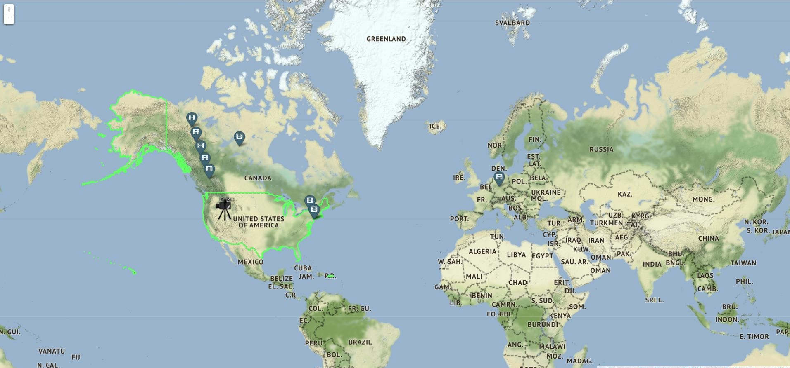

# Create a map in Python with the help of folium package!
Project involves working with a file of films (locations.list). 

Actually, it was very long, so I decided to make it smaller(now it consists of 100 or so films). 

This decision was made, so as you wait up to 2-3 minutes for your map to generate.
## Interaction
To generate a map, you'll need to use a command line. Arguments to type in:

* Year
* Latitude
* Longitude
* Path to dataset (locations.list)

Programe will try to find 10 places(where movies were filmed), which are the closest to the user's coordinates. 

In the example below, you can see that it's made by argparse.
Path to dataset (locations.list) can differ on your laptop.

```python
>>> python main.py 2016 56.83826 34.02324 D:\УКУ\ОП\semester_2\Homework\Lab1\Task_2\locations.list
```

## Create a Map
With the previous example, you'll get map like this:



You can zoom in to see exactly where movie was filmed. 

Also, you are encouraged to click on the marker(*Click For More Info*). 

And the moment you click, you get the full name of film.

 

Also, as I said earlier, you get 10 markers(don't count that camera marker, will say about it later). 

If you count cadetblue markers(ones with film icons), you get only 9. 

It can seem to you that one is overlayed, but if you zoom in, you'll see them both. 

 

There is one additional camara marker on the map. 

When you click on it you will get text *US is the country with the largest number of film productions!* 

And because of this high status, I've decided to lead round America with light green colour. This was made with the help of .json file.

## How do I open my map?

Look up in the folder of project and there should be a .html file.

Open it with the help of your browser and enjoy discovering your map!
